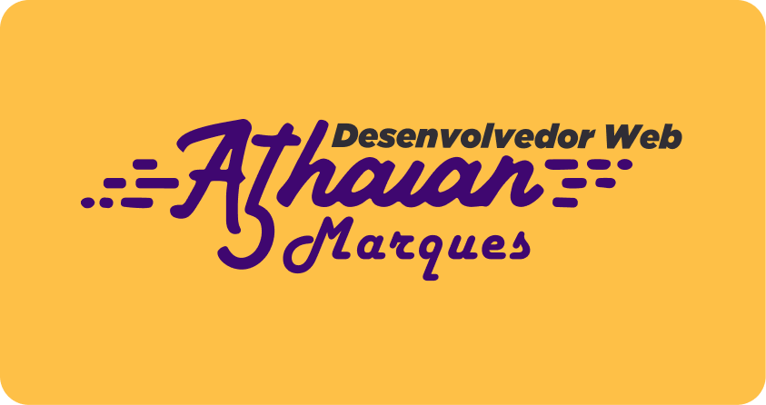

<div align="center">
</img>
<br> <br>
</div>

# Portfolio Athauan Marques

Bem-vindo ao repositório do meu Portfólio Pessoal! Este é um projeto dedicado a apresentar minhas habilidades, projetos e experiências profissionais de uma maneira organizada e atraente. Sinta-se à vontade para explorar e conhecer mais sobre mim.

## Visão Geral

Meu Portfólio Pessoal é uma plataforma centralizada onde compartilho informações sobre meu background, habilidades técnicas, projetos anteriores e meu contato. A ideia principal é proporcionar uma visão abrangente das minhas capacidades e conquistas.

## Estrutura do Projeto

- **index.html**: Página inicial do meu portfólio, contendo uma breve introdução e links para seções relevantes.
- **artigos.html**: Onde compartilho diversos assuntos, experiências profissionais e interesses.
- **projetos.html**: Uma lista de projetos que eu participei, cada um com uma breve descrição e links para os repositórios ou páginas do projeto.

## Como Visualizar

1. **Clone o Repositório:**
    ```bash
    git clone https://github.com/seu-usuario/portfolioamc.git
    ```

2. **Navegue até o Diretório:**
    ```bash
    cd portfolioamc
    ```

3. **Abra o Arquivo index.html no Navegador:**
    Abra o arquivo `index.html` em seu navegador preferido.

## Tecnologias Utilizadas

- **HTML5:** Estruturação da página.
- **CSS3:** Estilização e design responsivo.
- **JavaScript:** Interações dinâmicas na página.

## Contribuições

Se você encontrar algum problema, bug ou tiver sugestões para melhorar o meu Portfólio Pessoal, fique à vontade para abrir uma "issue" ou enviar um "pull request". Sua contribuição é bem-vinda!

## Contato

- **Email:** athauan.marques@gmail.com
- **LinkedIn:** [in/athauanmarques](https://www.linkedin.com/in/athauanmarques/)
- **Instagram:** [@athauanmarques](https://www.instagram.com/athauanmarques/)

Obrigado por visitar meu Portfólio Pessoal! 😊